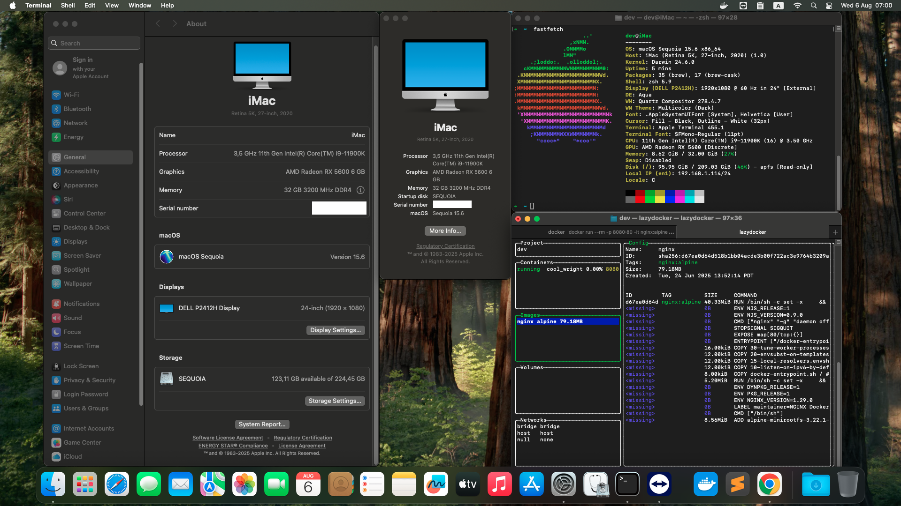

# ASUS B560 PRIME PLUS - HACKINTOSH SEQUOIA

### OpenCore: 1.0.6

- SMBIOS: iMac20,2
- Main: Asus B560 Prime Plus
- VGA: AMD Radeon RX 5600 XT 6GB Phantom Gaming
- CPU: Intel 11th Gen i9-11900K
- RAM: 2 x 16GB 3200Mhz DDR4
- SSD: 512GB (KINGSTON SA2000M8500G)
- Ethernet: Intel I219V14
- WIFI: BCM943602CS + (FIX BY GUI APP: [OpenCore-Patcher-GUI.app.zip](https://github.com/dortania/OpenCore-Legacy-Patcher/releases/download/2.2.0/OpenCore-Patcher-GUI.app.zip), AND PACKAGE: [OpenCore-Patcher.pkg](https://github.com/dortania/OpenCore-Legacy-Patcher/releases) )
- Bluetooth: YES (BCM_4350C2)
- AirDrop: YES
- Thunderbolt: Not Support

### Docker

- Xcode 16.4 + Simulators: YES
- Docker Desktop: YES
- OrbStack: NO

- [EFI.zip](./EFI.zip)
- [F2 or DEL - Main BIOS SETUP - Images.zip](./F2%20or%20DEL%20-%20Main%20BIOS%20SETUP%20-%20Images.zip)

