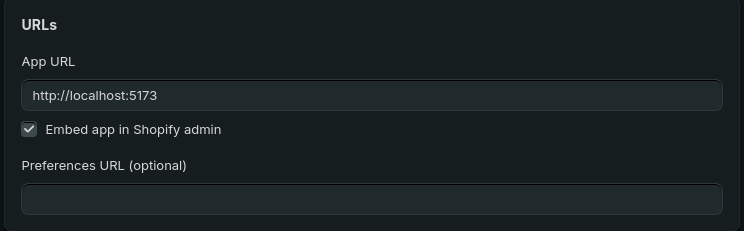
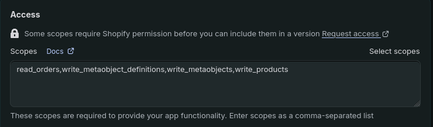
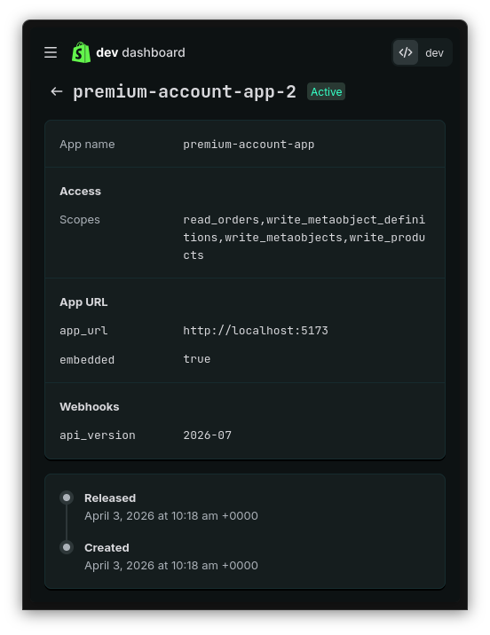
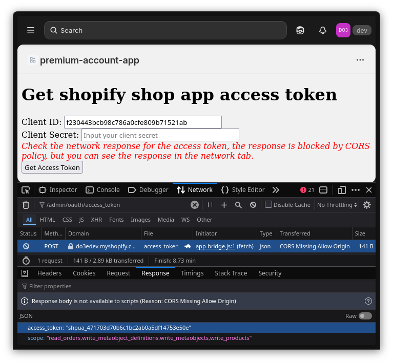

# get-shopify-shop-app-access-token

- Config: `dev.shopify.com` > `dashboard` > `Apps` > `Versions` > `Create version`

- App URL: `http://localhost:5173`



- Access Scopes: `write_products,...`



- `Active version`



- Config UI: `index.html` replace `content="xxxxxxxxxxxxxxxxxxxxxxxxxxxxxxxxx"` ( from `dev.shopify.com` > `dashboard` > `Apps` > `Settings` > `Client ID` )

```html
<!doctype html>
<html lang="en">
  <head>
    <meta charset="UTF-8" />
    <meta name="viewport" content="width=device-width, initial-scale=1.0" />
    <title>get-shopify-shop-app-access-token</title>

    <!-- Config your shopify-api-key in the meta tag, and the client_id input will be filled with the value of shopify-api-key -->
    <meta name="shopify-api-key" content="xxxxxxxxxxxxxxxxxxxxxxxxxxxxxxxxx" />

    <!-- Shopify App Bridge -->
    <script src="https://cdn.shopify.com/shopifycloud/app-bridge.js"></script>
  </head>
  <body>
    <h1>Get shopify shop app access token</h1>
    <div>
      Client ID:
      <input type="text" id="client_id" readonly style="width: 300px" />
      <br />
      Client Secret:
      <input
        type="password"
        id="client_secret"
        placeholder="Input app client secret"
        style="width: 300px"
      />
      <br />
      <i style="color: red">
        Check the network response for the access token, the response is blocked
        by CORS policy, but you can see the response in the network tab.
      </i>
      <br />
      <button type="submit" onclick="submitForm()">Get Access Token</button>
    </div>

    <script>
      const client_id = document.getElementById("client_id");
      client_id.value = document
        .querySelector('meta[name="shopify-api-key"]')
        .getAttribute("content");
      const client_secret = document.getElementById("client_secret");

      async function submitForm() {
        const shop = shopify.config.shop;
        const url = `https://${shop}/admin/oauth/access_token`;

        const formData = new FormData();
        formData.append("client_id", client_id.value);

        formData.append("client_secret", client_secret.value);
        client_secret.value = "";

        formData.append(
          "grant_type",
          "urn:ietf:params:oauth:grant-type:token-exchange",
        );
        formData.append("subject_token", await shopify.idToken());
        formData.append(
          "subject_token_type",
          "urn:ietf:params:oauth:token-type:id_token",
        );
        formData.append(
          "requested_token_type",
          "urn:shopify:params:oauth:token-type:offline-access-token",
        );
        formData.append("expiring", "0");

        fetch(url, { method: "POST", body: formData });

        alert(
          "Check the network response for the access token, the response is blocked by CORS policy, but you can see the response in the network tab.",
        );
      }
    </script>
  </body>
</html>
```

- Run http port `5173`, install app and open shop UI

```shell
npx serve -p 5173
```

- Input app `client secret` ( from `dev.shopify.com` > `dashboard` > `Apps` > `Settings` > `Secret` )
- Open develop > `Network` > filter `/admin/oauth/access_token` > `Response`


